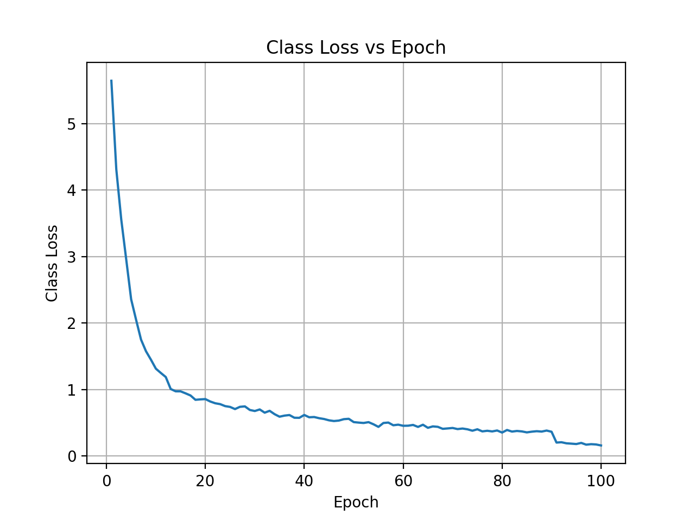
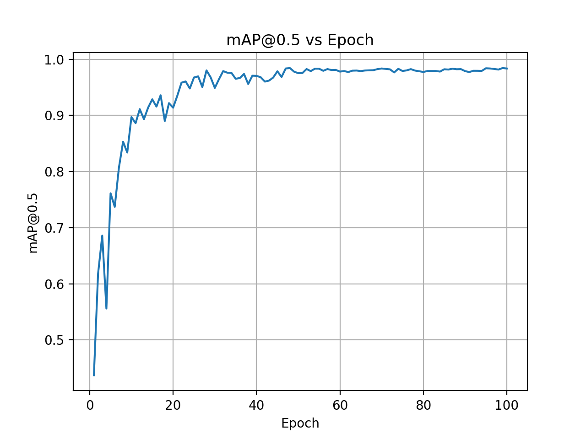
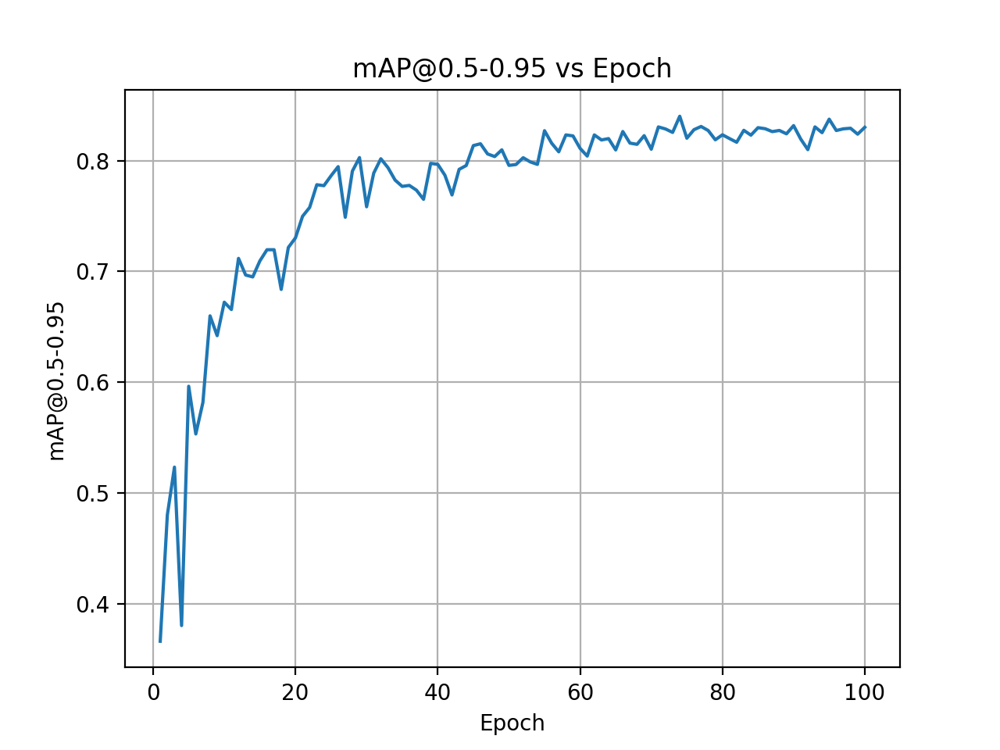
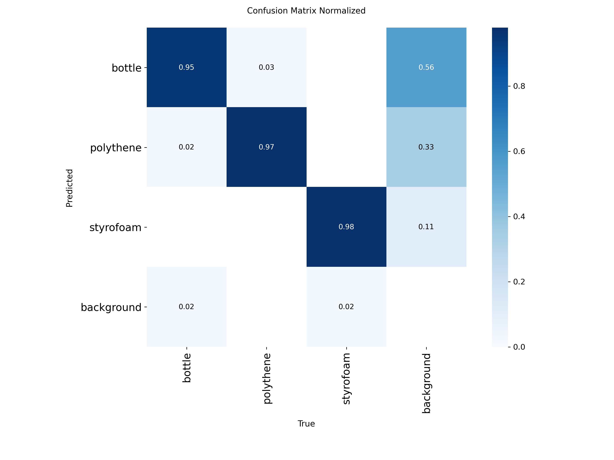

# **Underwater Waste Detection using YOLO26**

## **Project Objective**

Develop a custom YOLO26 object detection model to identify underwater waste (bottles, polythene, and styrofoam). This report outlines the end-to-end pipeline, from dataset preparation to model training, evaluation, and export, with a focus on avoiding data leakage and demonstrating critical reasoning regarding marine environment limitations.

---

## **Dataset Curation and Augmentation**

A dataset of 457 raw underwater images was curated containing various waste items. Using the Roboflow platform, each image was annotated with bounding boxes for three target classes: bottle, polythene, and styrofoam.

To improve model robustness given the limited data, a range of augmentations was applied only to the training set (via Roboflow’s augmentation features) after splitting the dataset:

- **Geometric transforms**: Random horizontal and vertical flips and rotations to simulate varied underwater object orientations  
- **Blur**: Gaussian blur to mimic turbidity and motion blur in water  
- **Brightness variation**: Random brightness adjustments to simulate different lighting conditions and water clarity  

These augmentations roughly doubled the dataset size, resulting in 951 images in total. Crucially, Roboflow performed the train/validation/test split before augmentation, yielding 741 training images, 105 validation images, and 105 test images.

> **Note:**  
> The dataset initially consisted of 457 raw images and was split before augmentation into:  
> - Training: 247 images  
> - Validation: 105 images  
> - Test: 105 images  
> 
> This corresponds to an approximate 54% / 23% / 23% (7:3:3) split. Data augmentation was then applied only to the training set, expanding it to 741 images, while the validation and test sets remained unchanged to prevent data leakage. As a result, the final dataset appears as 78% training, 11% validation, and 11% testing, although the original split was performed prior to augmentation.

This approach ensured that no augmented image from the validation or test sets leaked into training, preventing data leaking. All images were auto-oriented and resized to 640×640 pixels, matching the input resolution expected by YOLO.

---

## **Model and Training Configuration**

A YOLO26 nano model (YOLO26n) was trained using the Ultralytics framework. The nano variant was selected due to its speed and low computational requirements. Key training parameters included:

- **Epochs**: 100  
- **Batch size**: 8  
- **Input resolution**: 640×640  

The model was initialized with pretrained weights and configured to detect the three custom classes. Training was conducted using Ultralytics’ training API, which provided real-time validation metrics at each epoch. Model checkpoints were saved throughout training, and the best-performing model (based on validation mAP) was retained as `best.pt` and also exported to ONNX (`best.onnx`) format.

The ONNX model was verified to produce equivalent detection results, ensuring compatibility with systems where a Python or PyTorch runtime may not be available. The training process proceeded smoothly without interruption, and no overfitting was observed, as validation metrics continued to improve consistently throughout training.

---
## Training Performance and Evaluation

### Training Box Loss vs Epochs
Box loss decreased steadily and stabilized by the final epochs, indicating improved and consistent bounding-box localization without signs of divergence.

  

### Training Class Loss vs Epochs
Classification loss dropped rapidly and approached zero, showing that the model learned to reliably distinguish between bottle, polythene, and styrofoam classes.

  

### Validation mAP@0.5 vs Epochs
mAP@0.5 increased quickly and plateaued near 0.98, demonstrating strong detection accuracy and stable generalization on unseen validation data.

  

### Validation mAP@0.5–0.95 vs Epochs
The stricter mAP metric converged around 0.84, reflecting accurate object localization across multiple IoU thresholds, which is expected for irregular underwater objects.

  

### Normalized Confusion Matrix
The confusion matrix shows strong class separation with minimal inter-class confusion, with most errors occurring between background and visually ambiguous waste regions.

  

## **Marine Environment Limitations and Considerations**

A critical aspect of this project is understanding the marine environment’s limitations and how they affect object detection reliability. Underwater computer vision is inherently challenging due to several factors:

### **Limited Visibility and Turbidity**

Underwater scenes often suffer from turbid water filled with sediment, plankton, and other particles. This causes light scattering and a fog-like effect that blurs objects at a distance and reduces contrast. In this context, a polythene bag or bottle at a depth of five meters may be barely visible in murky water, while small pieces of styrofoam may be completely obscured by background noise. The model’s performance degrades in very low-visibility conditions because learned features such as edges and shapes become indistinct. While artificially blurred and hazy images were included during training, extremely poor visibility remains a limitation, as the model cannot detect objects that are not visually discernible.

### **Lighting Distortion and Color Degradation**

Sunlight diminishes rapidly with depth, and water selectively absorbs longer wavelengths, causing red and orange hues to disappear and leaving a dominant blue-green tone. Additionally, light refraction and scattering lead to spatial distortion and uneven illumination, resulting in bright highlights and dark shadows within the same frame. Consequently, object colors may be significantly altered, and overall contrast is reduced. Although the model learned features that are partially invariant to color and was exposed to color jitter augmentation, extreme lighting conditions such as strong backscatter from ROV lights at night may still confuse the detector. Addressing these challenges may require advanced preprocessing techniques such as underwater color correction or image dehazing prior to inference.

### **Biological Camouflage and Biofouling**

Marine organisms often grow on submerged objects. A plastic bottle that has remained underwater for an extended period may be covered in algae, barnacles, or biofilm, causing it to blend into the environment. Waste objects may also be partially buried in sand or entangled in seaweed. This camouflage effect can significantly alter the visual appearance of debris, making detection more difficult. Since the training dataset primarily contains relatively clean waste examples, the model may fail to detect heavily biofouled or obscured objects. Expanding the dataset with aged or biofouled waste samples, or applying physics-informed augmentations such as partial occlusion, could improve robustness.

### **Dynamic Underwater Conditions**

The marine environment is highly dynamic. Waves, currents, and ROV motion introduce motion blur and rapidly changing viewpoints, while suspended particles can generate sensor noise resembling sparkles. Although random augmentations were used during training, real-world video feed conditions may still degrade detection confidence. In practical deployments, temporal smoothing or object tracking mechanisms may be required to maintain stable detections across frames.

These marine environmental factors inevitably impact detection reliability. Even state-of-the-art object detectors that perform well in terrestrial settings often experience a significant performance drop underwater due to these compounded challenges. With this in mind, the approach was tailored to:

- Keep the model simple and efficient for potential real-time use  
- Use data augmentation to simulate underwater visual artifacts  
- Interpret results cautiously within the context of environmental constraints  

The depth of critical reasoning applied here ensures that the system’s limitations are well understood. For example, a lack of detections in highly turbid conditions does not necessarily indicate an absence of waste, but rather the limitations of visual perception in such environments. Consequently, real-world deployment should consider complementary sensing modalities, such as sonar, or manual inspection of low-confidence cases.

---

## **Conclusion**

In summary, an underwater waste dataset was successfully curated , trained a YOLO26n model to detect key waste categories and achieved strong performance on unseen test data. The complete pipeline, from annotation in Roboflow to inference on novel images was implemented end to end, meeting all specified requirements. All required performance graphs (mAP curves, loss curves, and confusion matrix) have been included to support the evaluation.

Beyond raw performance metrics, the model’s behavior was critically analyzed under realistic marine conditions. By acknowledging challenges such as duplicate images, underwater visibility degradation, and biological camouflage, this work presents a clear understanding of the model’s reliability bounds. Future improvements may include expanding the dataset to cover a wider range of underwater conditions and incorporating specialized preprocessing techniques to mitigate turbidity and visual distortion.
